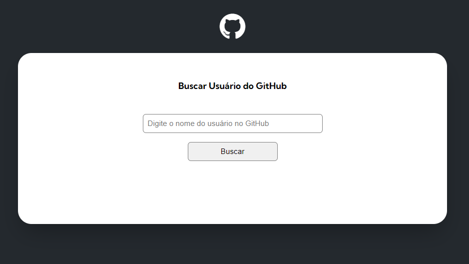
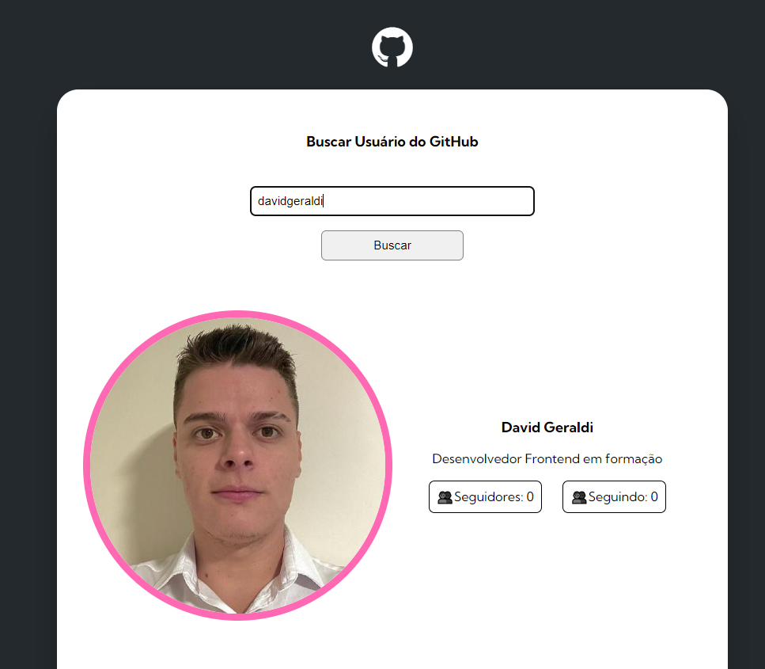
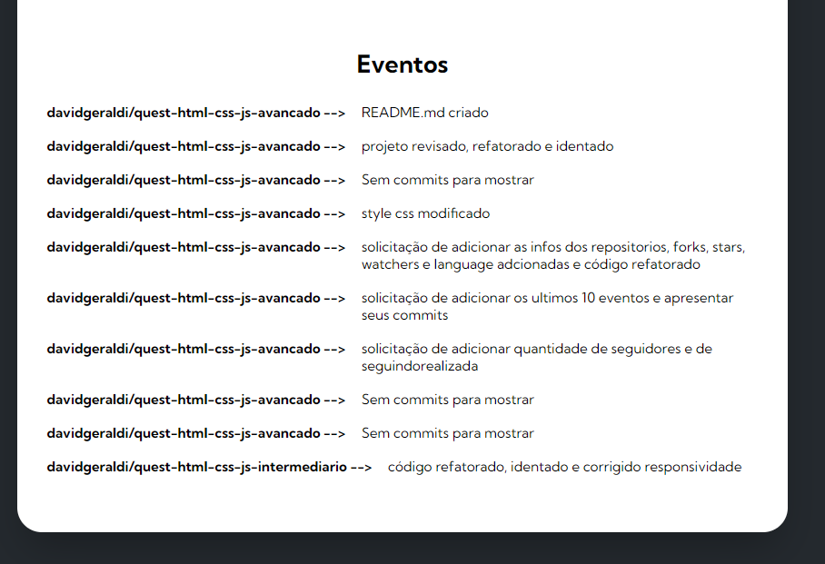
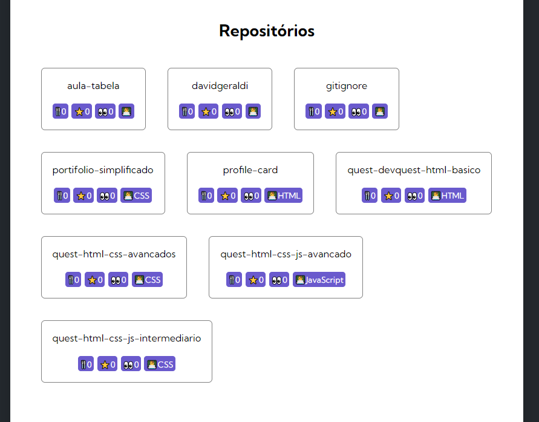
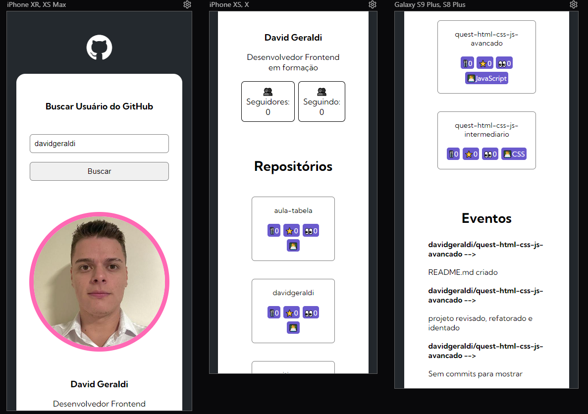

# API do GitHub para busca de usuários

## Sobre o desafio
Quest de HTML, CSS e JS Avançados do curso DevQuest. Com as habilidades adquiridas durante o curso, foi realizado as 3 solicitações. 
Primeira solicitação: Adicionar o número de seguidores e seguindo do usuário
Segunda solicitação: Mostrar os últimos 10 eventos do usuário com seus respectivos commits
Terceira solicitação: Adicionar além dos nomes dos repositórios, os dados de forks, stars, watchers e a linguagem do repositório.

## Tela inicial
Tela inicial da página, para realizar a busca do usuário do GitHub.

## Tela solicitação de mostrar os seguidores e seguindo do usuário

## Tela com a segunda solicitação de mostrar os últimos 10 eventos do usuário

## Tela com a terceira solicitação de mostrar os forks, stars, watchers e a linguagem usada nos repositórios

## Tela responsiva para mobile

## Conclusão do desafio

Com as habilidades que adquiri no curso, até que consegui me sair bem, lembrei dos conceitos async/await; aprendi a separar as responsabilidades para deixar o código mais clean. 

## Tecnologias utilizadas:

 
    <ul>
        <li>HTML 5
        
        </li>
         
        <li>CSS 3
        
        </li>
         
        <li>JavaScript
        
        </li>
    </ul>

